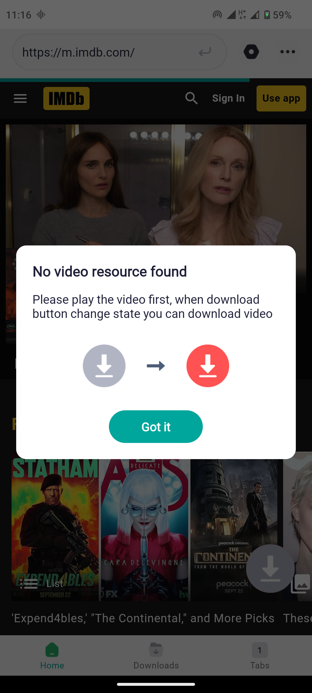
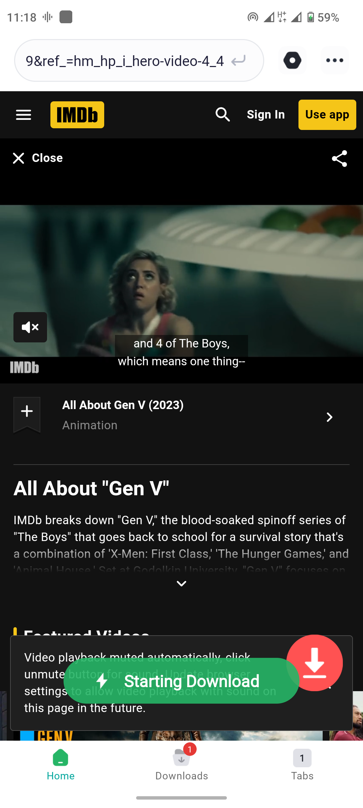
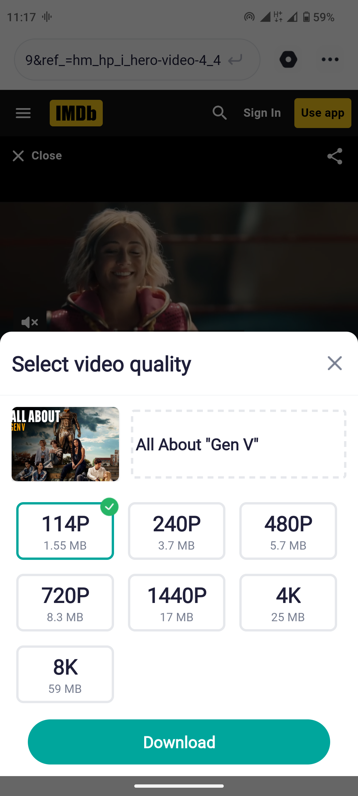
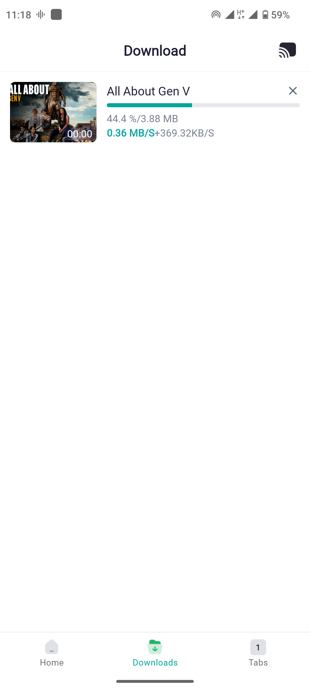
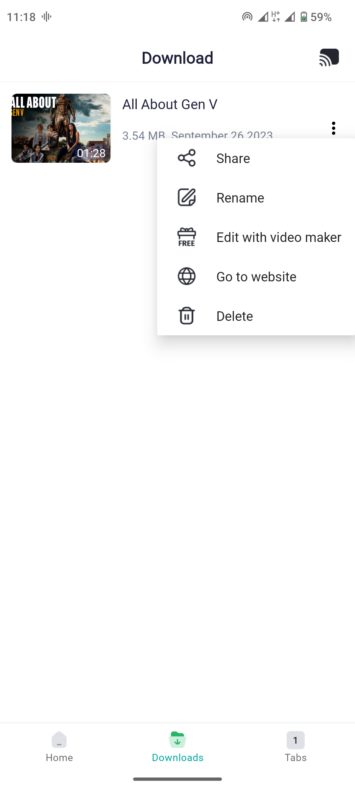

# VideoDownloader-Advanced

Android library wrapper for [youtube-dl](https://github.com/rg3/youtube-dl) executable.
Based on [yausername's youtubedl-android](https://github.com/yausername/youtubedl-android) but with ability to download videos in different resolutions from more than
[other 1000 sites](http://rg3.github.io/youtube-dl/supportedsites.html)

## Features

- Download videos from Youtube, Facebook, Twitter, Instagram, Dailymotion, Vimeo and more than [other 1000 sites](http://rg3.github.io/youtube-dl/supportedsites.html)
- Browse videos with the built-in browser
- Download videos with the built-in download manager
- Play videos offline with the built-in player
- Save your favorite videos online and watch them later without downloading them
- Save bookmark and history as a real browser
- Scan website to get download link 
- Download video in different resolution

## Screenshots

  
  

## License

This package is licensed under the MIT license. See [LICENSE](./LICENSE) for details.